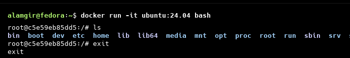
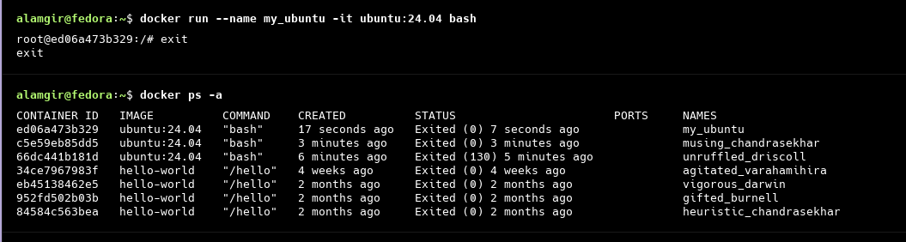

<h1>1. Docker Basic Workflow (Ubuntu Example)</h1>

1. Pull Ubuntu Image from Docker Hub
   

2. Verify Downloaded Docker Images
   

3. Run Ubuntu Container in Interactive Mode
   

4. List All Containers (Running + Stopped)
   

5. Create a Named Ubuntu Container
   

6. Access a Running Container Using Name
   

---

<h1>2. Create a Custom Docker Image</h1>

<h3>Step 1: Create a Dockerfile</h3>

```dockerfile
FROM ubuntu:24.04
RUN echo "Hello Alamgir" > /hello.txt
CMD ["cat", "/hello.txt"]
```

<h3> Step 2: Build the Image</h3>

```bash
docker build .
docker build -t custom_ubuntu . # assigns a name (tag) to the image
```


<h3>Step 3: Run the Custom Image</h3>

```bash
docker run custom_ubuntu
```


