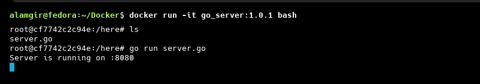

<h1>1. Run a software into Docker Container</h1>

1. Pull the ubuntu image

    ```bash
    docker pull ubuntu:24.04 
    docker run --name my_ubuntu -it ubuntu:24.04 bash
    ```
2. run a container from the ubuntu image

    ```bash
    docker exec -it my_ubuntu bash
    ```
3. install golang inside the container

    ```bash
    apt update
    apt install golang
    go version           # verify install
    ```
4. copy file from host machine to docker container

    1. make a directory in container
    

    2. copy file from host to container   
    

    3. Verify the copied file
    

5. run the file
 
    
    


<Details>
<summary>server.go</summary>

```go
package main

import (
	"fmt"
	"net/http"
)

func main() {
	http.HandleFunc("/", func(w http.ResponseWriter, r *http.Request) {
		fmt.Fprintln(w, "Hello World!")
	})

	fmt.Println("Server is running on :8080")
	http.ListenAndServe(":8080", nil)
}
```

</Details>

>so Finally we run a  software (server.go) into Docker Container.


---


<h1>2. Create a Docker Image from a Running or Stopped Container</h1>


<h3> When to Use docker commit</h3>

* To quickly save changes made inside a container
* For experiments, debugging, or learning purposes

<h2>Step to create</h2>

<h3>1. Commit a Container to an Image</h3>

General Syntax : ```docker commit <container_id_or_name> <image_name>```

Example

```bash
docker ps
docker commit ed06a473b329 go_server
```


 This command creates a new image named **`go_server`** from the current state of the container `ed06a473b329` (named `my_ubuntu`).


<h3>2. Verify the Created Image</h3>

```bash
docker images
```


<h3>3. Important Observation</h3>

> The **`go_server` image is exactly the snapshot of the `my_ubuntu` container** at the time of commit.

* All installed packages
* All file changes
* All configurations

Everything is baked into the **go_server** image.


---

<h1> Limitation of docker commit</h1>

Suppose:

* Your application file (e.g., `server.go`) changes

Then you must:

1. Run a container again
2. Manually edit files
3. Reinstall dependencies (Go, libraries)
4. Commit the container again

>This process is **manual, error-prone, and not reproducible**.


<h1>Recommended Solution: Dockerfile</h1>

Instead of using `docker commit`, use a **Dockerfile**

<h3>Why Dockerfile is Better</h3>

| docker commit          | Dockerfile         |
| ---------------------- | ------------------ |
| Manual process         | Automated          |
| Not reproducible       | Fully reproducible |
| Hard to maintain       | Easy to maintain   |
| Not version-controlled | Version-controlled |


---


<h1> Using Dockerfile : Run a software into Docker Container</h1>

1. Create the Dockerfile 

    <Details>
    <summary>Dockerfile</summary>

    ```Dockerfile
    FROM ubuntu:24.04 
    RUN apt update
    RUN apt install -y golang
    WORKDIR /here
    COPY ./server.go  ./server.go
    ```
    </Details>


    | Dockerfile Instruction         | Explanation                                                                                          |
    | ------------------------------ | ---------------------------------------------------------------------------------------------------- |
    | `FROM ubuntu:24.04`            | Sets Ubuntu 24.04 as the base image that provides the Linux environment for the container.           |
    | `RUN apt update`               | Updates the system package index so new software can be installed correctly.                         |
    | `RUN apt install -y golang`    | Installs the Go  inside the container. The `-y` flag avoids manual confirmation. |
    | `WORKDIR /here`                | Creates (if not exists) and switches to `/here` as the default working directory.                    |
    | `COPY ./server.go ./server.go` | Copies `server.go` from the host machine into the container’s working directory.                     |


2. Build the Dockerfile and set name


3. Verfiy the image


4. Run the newly build image


5. Verify the output


---

