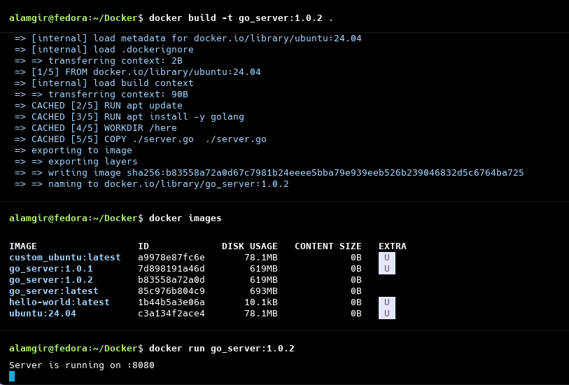

<h1>CMD Command</h1>

---

<Details>
<summary>Dockerfile</summary>

```Dockerfile
FROM ubuntu:24.04 
RUN apt update
RUN apt install -y golang
WORKDIR /here
COPY ./server.go  ./server.go

CMD [ "go", "run","server.go" ]
```
</Details>

<h2> In  above Dockerfile, CMD does this - </h2>

* Runs the go application automatically
* Executes `server.go` **when the container starts**
*  don’t need to type the command manually inside the container

So when  run: ```docker run my_image``` 
Docker internally runs: ```go run server.go```


---


<h2> Important behavior of CMD</h2>

* `CMD` tells Docker what to run when the container starts.
* Only **one `CMD`** is allowed (last one wins)
* `CMD` can be **overridden** at runtime

Example: ```docker run -it  my_image bash```
➡ This replaces `CMD` and starts `bash` instead of `go run server.go`


<h2> Why CMD is useful ?</h2>

| Benefit          | Explanation                                        |
| ---------------- | -------------------------------------------------- |
| Auto start app   | Application runs immediately when container starts |
| Cleaner workflow | No need to `exec` into container                   |
| Reusable image   | Same image runs the app everywhere                 |
| Best practice    | Recommended for app startup                        |
