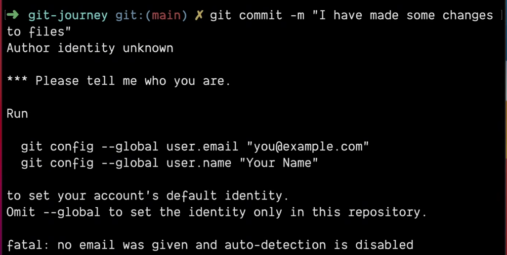

<h1>Git Configuration Levels</h1>

There are three configuration levels in gits.

- **1. System**: 

    - Command : `git config -system`
    - Saves to `/etc/gitconfig`, applies to all users.  

- **2. Global**: 

    - Command : `git config -global`
    - Saves to `~/.gitconfig`, applies to the current user.  

- **3. Local**: 

    - Command : `git config -local`
    - Saves to `.git/config` in the repository.


<h2> User Setup Steps</h2>
Users must configure name and email for commits.

- Set user name.  
- Set user email.



```bash

# locally : only for the current repo
git config user.name "Your Name"    
git config user.email "you@example.com"

# globally : applies to all repositories on  system
git config --global user.name "Your Name"   
git config --global user.email "you@example.com"  
```


<h2>Key Note</h2>

- Local overrides global, global overrides system level.
- For information releated to configuration : `git config --list`

