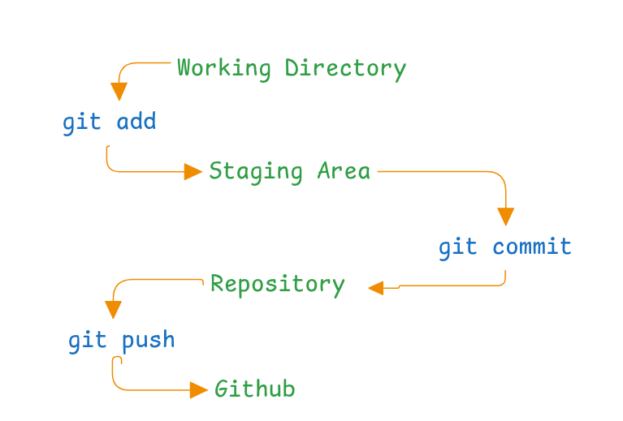

<h1> Git workflow </h1>



---
<h1>Staging Area</h1>

* An intermediate area between **working directory** and **commit**
* Holds changes that are **ready to be committed**
* Files enter the staging area using `git add`


<h1>Commit</h1>


After staging, files are ready to be **committed**.

* A **commit** is a snapshot of the repository at a specific time
* It saves the current state of the project
* Each commit includes a **message** describing the changes


---

**Common options:**

```bash
git commit                 # opens editor to write message
git commit -m "message"    # commit with a message
git commit -a -m "message" # stage & commit tracked files
git commit --amend         # edit last commit
```


<h2>Git Commit Dependency</h2>

* In Git, **every commit depends on the previous commit**
* The **first commit** has no parent
* Each commit forms a **linked history**, allowing Git to track changes over time


<h2> Commit Message Reminder</h2>

* Keep each commit focused on **one change** (feature, component, or fix)
* Use **present tense** and **imperative mood**
* Think of the message as a **command to the codebase**

**Example:**

* ✅ `Add user login validation`
* ❌ `Added user login validation`


>Git is made up of objects that are stored in the **.git/objects** directory. A commit is just a type of object.

