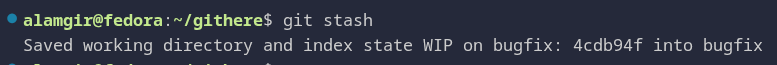

<h1>Git Stashing : Saving Unfinished Work</h1>

**Scenario**

* You are working on a branch and have **uncommitted changes**
* Switching to another branch may fail due to conflicts
> **Solution:** temporarily save your changes using **Git stash**

---

<h2> Basic Stash Commands</h2>

```bash
git stash                 # Save uncommitted changes and clean working directory
git stash list            # Show list of stashed changes

git stash apply           # Apply the most recent stash (keeps it in stash)
git stash apply stash@{2} # Apply a specific stash without removing it
git stash pop             # Apply the most recent stash and remove it from stash

git stash drop            # Remove latest stash
git stash drop stash@{2}  # Remove a specific stash
git stash clear           # Remove all stashes

git stash save "message"  # Save changes with a descriptive message

git stash branch <branch-name>   # create a new branch from a stash
```





---

**Notes**

* Stashes are stored in **stack order** (`stash@{0}` is the latest)
* Always check `git stash list` before popping or applying to avoid conflicts

