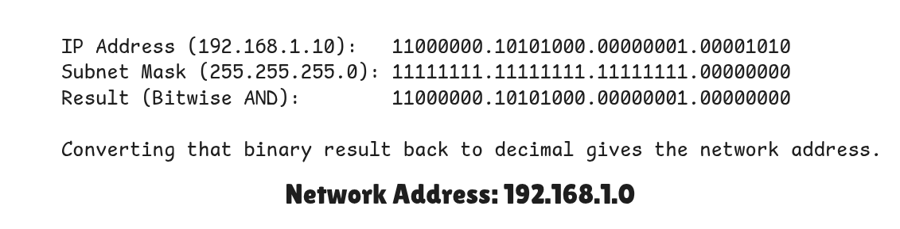

<h1>1. Subnet</h1>

A **subnet** is a smaller network inside a larger network.
It is defined by a **subnet mask**.

The subnet mask tells us:

* Which part is the **network**
* Which part is for **hosts (devices)**


<h3>CIDR (Classless Inter-Domain Routing)</h3>

**CIDR** is a way to write IP addresses using a slash (`/`) followed by a number.The number after `/` shows how many bits are used for the **network part**.


* `/8 `   : 255.0.0.0
* `/16` : 255.255.0.0
* `/24` : 255.255.255.0
 
 Example

```
192.168.1.0/24

or

192.168.1.0
255.255.255.0
```

* `/24` means first 24 bits are Network part , last 8 bit are Host Part
* Subnet mask = **255.255.255.0**
* Total addresses = 256
* Usable hosts = 254


---

<h1>2. Network Address</h1>

The **network address** identifies the whole network.

- It is the **first address** in the subnet.
- It cannot be assigned to a device.

<h1> 3.  Broadcast Address</h1>

The **broadcast address** is used to send data to all devices in the network.

-  It is the **last address** in the subnet.
- It also cannot be assigned to a device.

---

<h1>Example</h1>

Given:

```
IP Address: 192.168.1.10
Subnet Mask: 255.255.255.0 (/24)
```

<h3>Step 1: Find Network Address</h3>

With /24:

* First 3 octets = network
* Last octet = host

So Network Address : **192.168.1.0**




<h3>Step 2: Find Broadcast Address</h3>

Since host portion is 8 bits:

* Lowest host value = 0
* Highest host value = 255

>Total Address Range : 192.168.1.0 – 192.168.1.255(256 total addresses)

So Broadcast Address : **192.168.1.255**


<h3>Step 3: Usable Host Range</h3>


Reserved Addresses

- 192.168.1.0 : Network address (cannot assign to devices)
- 192.168.1.255 : Broadcast address (cannot assign to devices)

So,

- Usable hosts =256 − 2 = **254**
- Devices can use: 192.168.1.1 – 192.168.1.254


