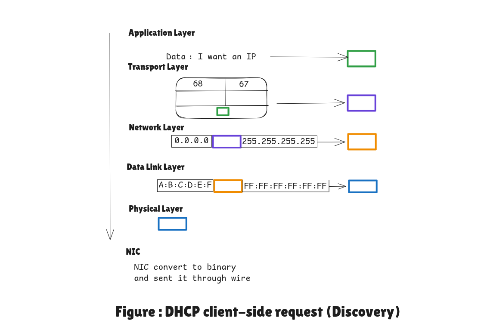

<h1> DHCP Discovery (Client Side) – Layer by Layer</h1>

1.  **Application Layer**

    * Client says: “I need an IP”
    * DHCP software creates the request.

2. **Transport Layer (UDP)**

    - Source Port (68): Reserved port for DHCP clients.
    - Destination Port (67):  DHCP Server port(the router)

3. **Network Layer (IP)**

    - Source IP: 0.0.0.0 (because the client has no IP yet)
    - Destination IP: 255.255.255.255 (broadcast ip, because client doesn’t know server/router IP)

4. **Data Link Layer (MAC)**

    - Source MAC: Client NIC MAC (e.g., A:B:C:D:E:F)
    - Destination MAC: Broadcast (FF:FF:FF:FF:FF:FF)

5. **Physical Layer & NIC**

    * NIC converts frame  to electrical/wireless signals and sent on network.

<h3>Step-by-Step Flow of DHCP Discovery</h3>

| Layer | Information Checked | Device Action (Non-Router) | Router Action |
| --- | --- | --- | --- |
| **Data Link** | MAC: `FF:FF:FF:FF:FF:FF` | "It's a broadcast, I'll take it." | "It's a broadcast, I'll take it." |
| **Network** | IP: `255.255.255.255` | "It's a broadcast, keep going." | "It's a broadcast, keep going." |
| **Transport** | **Port: 67** | **"I don't have this port open. DROP."** | **"I am a DHCP Server. ACCEPT."** |

Key Clarification:

- Broadcast goes everywhere, but Transport Layer filtering (port numbers) ensures only the DHCP server processes it.

- Other devices just drop the packet because nothing listens on UDP 67.