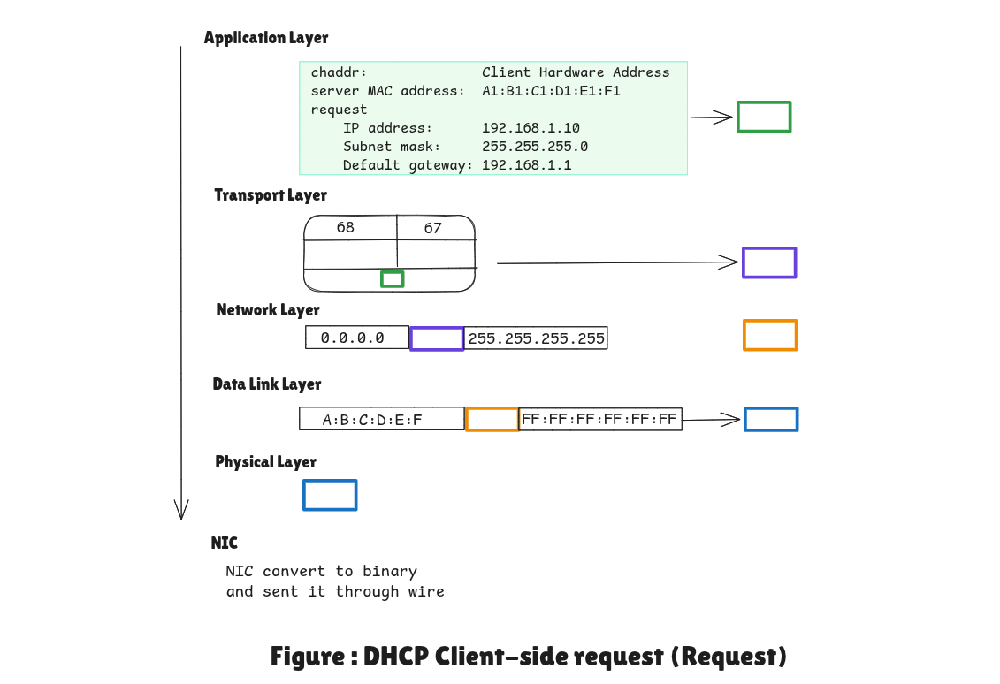

<h2>Summary Table for the DHCP Request</h2>

| Layer | Information Checked | Other DHCP Servers | The Chosen Router |
| --- | --- | --- | --- |
| **Data Link** | MAC: `FF:FF:FF:FF:FF:FF` (usually) | "I'll listen to this broadcast." | "I'll listen to this broadcast." |
| **Network** | IP: `255.255.255.255` | "I'll keep reading." | "I'll keep reading." |
| **Transport** | **Port: 67** | "Checking my offers..." | "Checking my offers..." |
| **Application** | **Requested IP & Server ID** | **"They didn't choose me. I'll take back my IP offer."** | **They want my IP! Time to send the ACK."** |

---

<h2>Summary Table: How the Client Processes the DHCP ACK</h2>

| Layer | Information Checked | Other Devices (Phones, etc.) | The Client (Your Computer) |
| --- | --- | --- | --- |
| **Data Link** | MAC: `FF:FF:FF:FF:FF:FF` | "Broadcast, I'll take it." | "Broadcast, I'll take it." |
| **Network** | IP: `255.255.255.255` | "Broadcast, keep reading." | "Broadcast, keep reading." |
| **Transport** | **Port: 68** | "Not my traffic. DROP." | **"I am the Client. ACCEPT."** |
| **Application** | **DHCP Message Type: ACK** | (Already dropped) | **"Confirmation received! I am now 192.168.1.10!"** |

**Notes:**

* Client IP is updated only **after processing ACK**.
* **Lease Time** tells how long the IP is valid.
* **APIPA (169.254.x.x)** is replaced by router-assigned IP.

