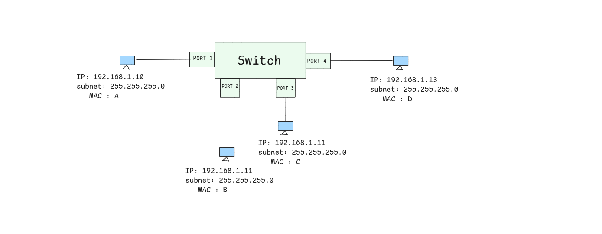
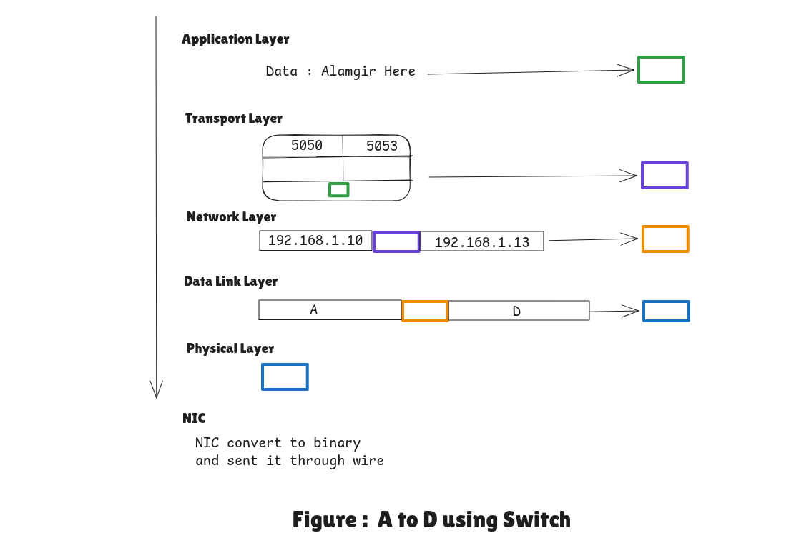
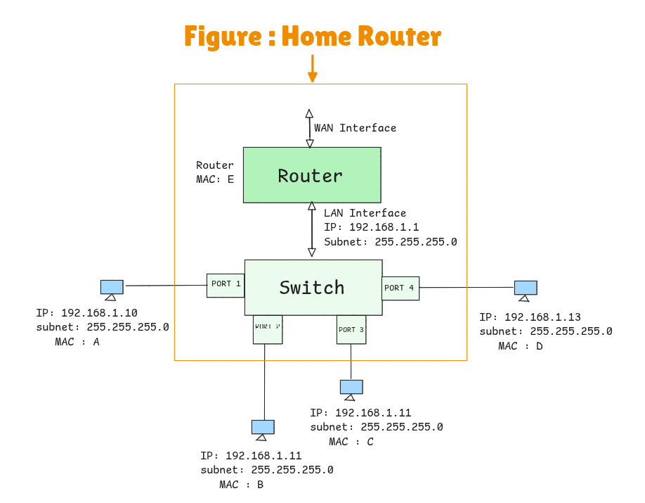
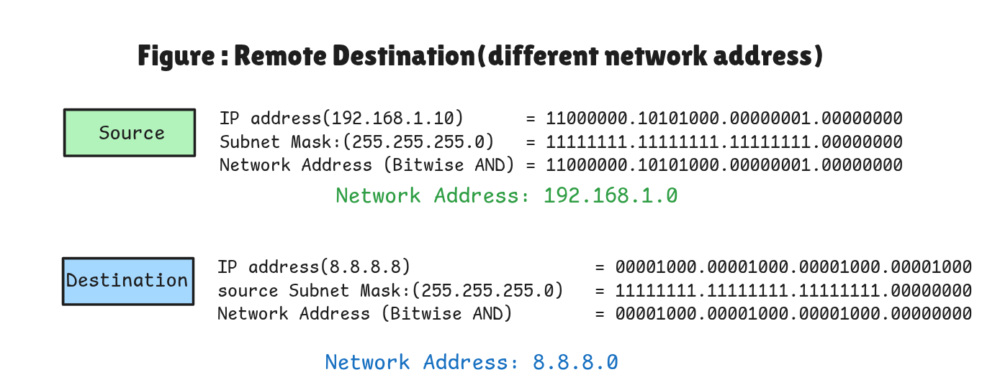

<h1>The Switch Learning Process</h1>

When **Computer A** sends data to **Computer D**:

1. MAC Learning

    - The switch looks at the Source MAC (A) and the physical port it arrived on (Port 1).
    * Stores entry in MAC Address Table/CAM table/Frowarding Database/Bridge Table
    -  Switch learns:  `MAC A → Port 1`

2.  Forwarding Decision

    * Switch checks **Destination MAC (D)**
    * If D is **in the table** 
        * Send frame **only to D’s port** (Unicast)
    * If D is **NOT in the table**
        * **Flood** frame to all ports except the incoming one
        * This is called **Unknown Unicast Flooding**
    -  After D Replies
        * Switch learns:  `MAC D → Port 3`

---

<h1>Gateway Decision</h1>

- If (Source IP & Mask) == (Destination IP & Mask) then Local
- If NOT equal : Send to Gateway

<h2> 1. A to D (Local Traffic)</h2>

* A (192.168.1.10) checks 192.168.1.13 with its subnet mask (/24).
* Result: Same network (192.168.1.0/24).

<h3>Network Layer (IP Layer) </h3>

* **Source IP:** `192.168.1.10`
* **Destination IP:** `192.168.1.13`

<h3>Data Link Layer (MAC Layer) </h3>

* **Source MAC:** `A`
* **Destination MAC:** `D`

<h2>Summary Table : Switch Communication</h2>

| Device | Layer Action | Result |
| --- | --- | --- |
| **Switch** | Learns MAC A is on Port 1 | Forwards to destination port(s). |
| **Computer B** | Checks MAC address: Matches B? **No** | **DROP** |
| **Computer C** | Checks MAC address: Matches C? **No** | **DROP** |
| **Computer D** | Checks MAC address: Matches D? **Yes** | **ACCEPT** |

<h2>2. A to 8.8.8.8 (Remote Traffic)</h2>

<h3>Network Layer (IP Layer) </h3>

* **Source IP:** `192.168.1.10`
* **Destination IP:** `8.8.8.8`

<h3>Data Link Layer (MAC Layer) </h3>

* **Source MAC:** `A`
* **Destination MAC:** `E` (Router MAC)

Because 8.8.8.8 is remote, the frame must go to the **Default Gateway (Router)**.

