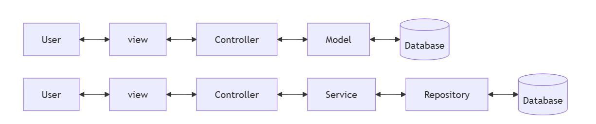

<h1 id="top">MVC Architecture</h1>

>- The Model-View-Controller (MVC) framework is a design pattern that separates an application into three components: Model,View ,Controller.
>- Each part has a clear responsibility, making applications easier to develop, maintain, and scale.

<h1 id="com">MVC Three Components</h1>

- View
    - Represents the UI (User Interface).
    - Should not contain business logic.
- Controller
    - Acts as a bridge between Model and View.
    - A java class which can handle a HTTP request coming from view layer.
    - Handles user requests, processes them, calls the Model for data, and returns output to the View.

- Model
    - write logic which is responsible for Database communication.
    - Manages database, state, rules, and validations.
    - Represents the data and business logic.
    -  Model layer divided into two part : 
        - Service
            - Contains business logic.
            - Coordinates between Controller and Repository.
        - Repository
            - Handles database operations.
            - Uses Spring Data JPA / Hibernate for CRUD.

<h2 id="flow">Flow of MVC</h2>

- User sends a request.
- Controller receives the request and calls the Model.
- Model interacts with the database / business logic and returns data.
- Controller passes the data to the View.
- View renders the response back to the user.

<h2>Disadvantages</h2>

- Can be complex for small applications.
- Requires understanding of layer interactions.
- Sometimes causes extra layers of code.

 

[↑ Back to top](#top)     
